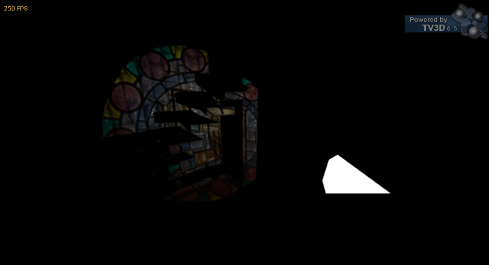

# Shaders
A collection of shader model 3.0 HLSL shaders

This is a collection of deferred rendering shaders I wrote back in 2009. They are made to work with the TrueVision3D 6.5 engine using DirectX 9.0c.

Included are shaders for screen space effects (HDR, radial blur, godrays), deferred rendering objects (with optional parallax), directional, point and spotlights. The spotlight shader also allows for projecting custom textures.

The shaders are provided as-is. When I went into the wonderful world of programming shaders, I had no clue where to start or how they would work, and I learned a lot from other open-source sources. I hope these will be similarly useful to someone.
